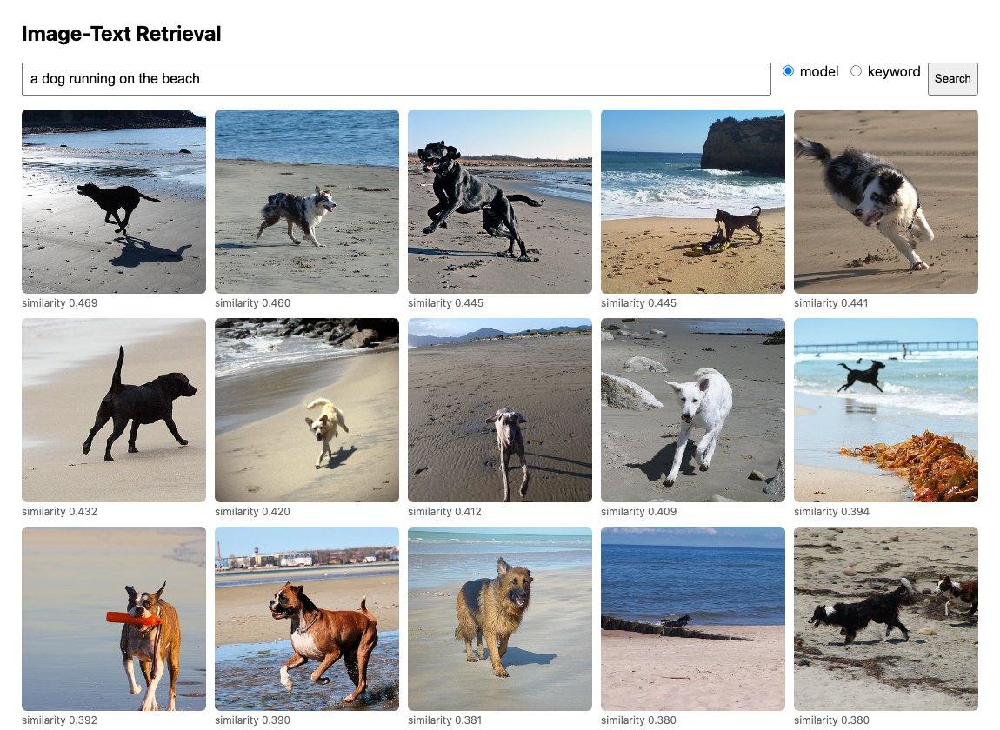
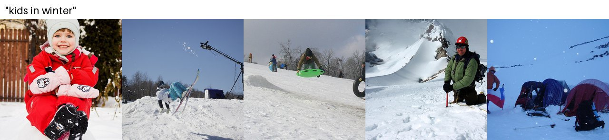
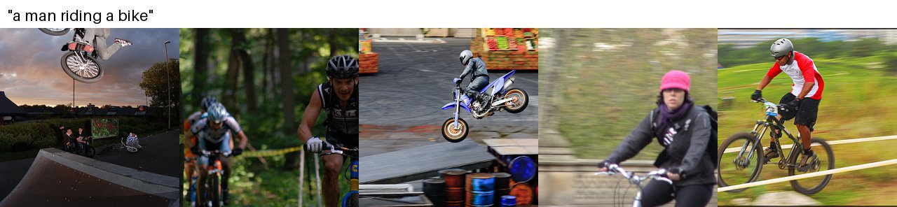
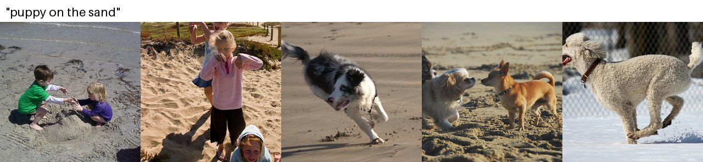

# Image-Text Retrieval Search Engine

A cross-modal image search engine: type a sentence, get the matching photos. Images are encoded with a pre-trained ResNet50, sentences with averaged GloVe word vectors, and a two-branch network trained with a hinge ranking loss maps both into a shared embedding space. A Flask web app ranks every image by cosine similarity to the query, with a classic inverted-index keyword search for comparison.



## Results

Trained on [Flickr8k](https://hockenmaier.cs.illinois.edu/8k-pictures.html) (6,000 training images with 5 captions each) and evaluated on the official 1,000-image test split (5,000 captions). Recall@K is the percentage of queries whose correct match is in the top K.

| Direction | R@1 | R@5 | R@10 |
|---|---|---|---|
| text → image (caption finds its photo among 1,000) | 18.8 | 45.2 | 58.4 |
| image → text (photo finds one of its captions among 5,000) | 26.4 | 54.8 | 67.8 |

Top 5 results for queries over the **test images only** (never seen in training):





The model generalizes beyond exact words: across all 8,000 images, keyword search finds only 4 images whose captions contain *kids*, *in* and *winter*, and 1 for *puppy on the sand*, while the model returns snowy scenes with children and dogs on sand. It also shows the limits of averaged word vectors: word order and counting are lost, so *children playing in the snow* also returns adults in the snow, and *puppy* is not separated from *dog* or *child*.

### Experiments

All runs use the same features and 30 epochs; the checkpoint is chosen on the validation split and reported on the test split.

| Model | Loss | Embedding | Weight decay | text → image R@1/5/10 | image → text R@1/5/10 |
|---|---|---|---|---|---|
| Linear | sum over negatives | 128 | 0 | 16.0 / 41.4 / 54.9 | 19.9 / 48.9 / 62.6 |
| Linear | hardest negative | 128 | 0 | 17.8 / 43.4 / 56.3 | 25.1 / 54.4 / 66.6 |
| Linear | hardest negative | 128 | 0.05 | 17.8 / 44.1 / 56.3 | 24.8 / 53.0 / 65.5 |
| **Linear** | **hardest negative** | **1024** | **0.05** | **18.8 / 45.2 / 58.4** | **26.4 / 54.8 / 67.8** |
| MLP (2048→512→emb) | sum over negatives | 128 | 0 | 16.5 / 42.4 / 55.3 | 23.1 / 49.7 / 62.5 |
| MLP | hardest negative | 128 | 0 | 2.2 / 8.3 / 13.7 (collapsed) | 2.0 / 6.9 / 13.4 |
| MLP | hardest, 3 warm-up epochs | 128 | 0 | 15.5 / 41.1 / 54.5 | 22.4 / 47.1 / 61.3 |
| MLP | hardest, 3 warm-up epochs | 1024 | 0.05 | 16.7 / 41.9 / 55.8 | 22.6 / 51.4 / 62.7 |

- The **hardest-negative** (VSE++) loss beats summing over all negatives, but from a random start it collapses the MLP; a few warm-up epochs with the sum loss fix that.
- With frozen ResNet50 and GloVe features, the extra MLP layer overfits instead of helping; the linear projection is best.
- All runs peak early (epoch 6–11 for the linear models), so validation-based checkpoint selection matters.

## Project Structure

```
image-text-retrieval/
├── download_data.py        # Step 0: Download Flickr8k + GloVe into data/
├── prepare_data.py         # Step 1: Official train/val/test split -> meta_data/*_data.json
├── inoutput_json.py        # Step 2: Inverted index (caption word -> pic_ids) for keyword search
├── extract_img.py          # Step 3a: ResNet50 image features (2048-dim)
├── extract_txt.py          # Step 3b: GloVe caption features (200-dim, mean of word vectors)
├── rank.py                 # Step 4: Train the cross-modal ranking model, report Recall@K
├── search.py               # Step 5: Text -> image search (command line)
├── Flask_Web.py            # Step 6: Search engine web interface
├── assets/                 # Images used in this README
└── requirements.txt
```

## Pipeline Overview

```
Flickr8k images + captions            GloVe 6B (200-dim)
          │                                  │
   prepare_data.py ──→ meta_data/{train,val,test}_data.json
          │                                  │
          ├── inoutput_json.py → meta_data/output.json (inverted index, keyword baseline)
          ├── extract_img.py   → features/img_*.npy   (ResNet50 avgpool, 2048-dim)
          └── extract_txt.py   → features/txt_*.npy   (mean GloVe vector per caption, 200-dim)
                        │
                     rank.py   → models/net.pt (+ net_results.json with Recall@K)
                        │
          search.py / Flask_Web.py → http://localhost:5001/
```

## Quickstart

```bash
pip install -r requirements.txt

python download_data.py     # ~2 GB download: Flickr8k images (1.1 GB) + GloVe (860 MB zip)
python prepare_data.py
python inoutput_json.py
python extract_img.py       # ~3 min on an Apple M1 GPU; uses CUDA / MPS / CPU automatically
python extract_txt.py
python rank.py              # ~1 min on CPU; prints validation and final test Recall@K
```

Search from the command line (`--gallery test` restricts the search to unseen test images, `--save_dir` writes result strips like the ones above):

```bash
python search.py "a dog running on the beach" "kids in winter" --top_k 5
python search.py "kids in winter" --mode keyword
```

Or run the web interface and open http://localhost:5001/:

```bash
python Flask_Web.py              # add --port to use another port
```

Port 5001 is the default because macOS reserves port 5000 for the AirPlay Receiver (it answers with 403 Forbidden).

The page ranks all 8,000 images with the model; the *keyword* option shows the inverted-index baseline (images whose captions contain every query word).

## Model

```
Image (2048-dim, ResNet50) ──→ L2-normalize ──→ Linear(2048, 1024) ──→ L2-normalize ─┐
                                                                                      ├─ cosine similarity
Text  (200-dim, mean GloVe) ──→ L2-normalize ──→ Linear(200, 1024)  ──→ L2-normalize ─┘
```

Training uses each (caption, image) pair in a batch of 128 as a positive and every other image and caption in the batch as negatives (captions of the same photo are excluded). The hinge loss `max(0, margin − s(pos) + s(neg))` with margin 0.2 is applied in both directions, using the hardest negative per query (VSE++). `python rank.py --help` lists the alternatives from the experiments table (`--arch mlp`, `--loss sum`, `--embed_size`, `--warmup_epochs`, `--weight_decay`).

## History

The first version of this project used 132,828 Chinese tag–image pairs from Baidu image search (`input.json`), word2vec features and a tag-lookup web page. The Baidu image links have since expired and the word vectors were not published, so the pipeline was moved to Flickr8k and GloVe, keeping the original design (ResNet50 + word vectors → two-branch projection → hinge loss) while fixing feature extraction, adding a proper train/val/test protocol and Recall@K, and making the web page rank images with the trained model.

## Notes

- `data/`, `features/`, `models/` and the generated `meta_data/*.json` are excluded from git; everything is rebuilt by the Quickstart commands.
- Flickr8k is for research use; see the dataset's terms. GloVe is released under the ODC-PDDL license.
